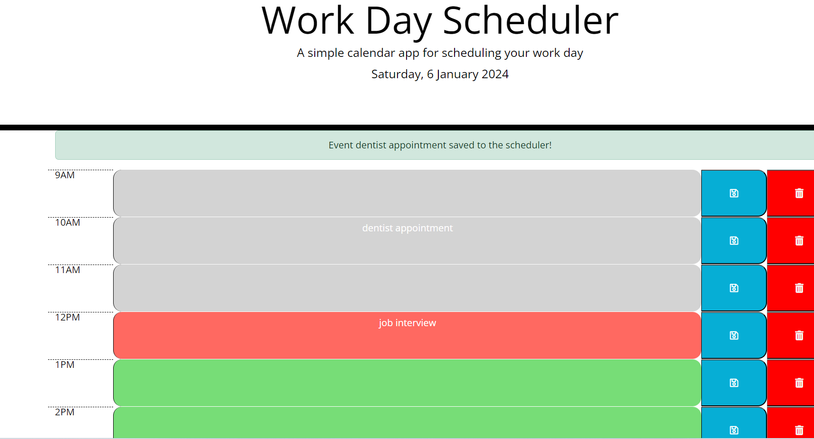
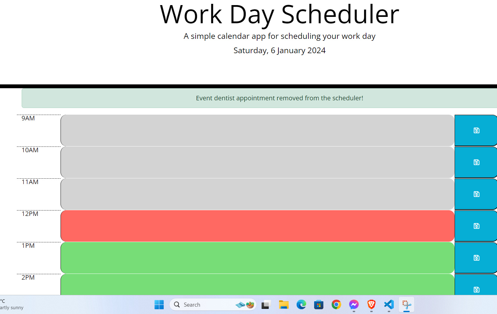

# Day Scheduler Application

A simple calendar application that allows users to save events for each hour of the day. This application runs in the browser and features dynamically updated HTML and CSS powered by jQuery. It uses the Day.js library for working with date and time.

## Table of Contents
- [User Story](#user-story)
- [Acceptance Criteria](#acceptance-criteria)
- [Badges](#badges)
- [Demo](#demo)
- [Features](#features)
- [Usage](#usage)
- [Installation](#installation)
- [Contributing](#contributing)
- [License](#license)
- [Links](#links)

## User Story

As an employee with a busy schedule, I want to add important events to a daily planner so that I can manage my time effectively.

## Acceptance Criteria

The app should:
- Display the current day at the top of the calendar when a user opens the planner.
- Present time blocks for standard business hours when the user scrolls down.
- Color-code each time block based on past, present, and future when the time block is viewed.
- Allow a user to enter an event when they click a time block.
- Save the event in local storage when the save button is clicked in that time block.
- Delete the event from local storage when the delete button is clicked in that time block.
- Persist events between refreshes of a page.

## Badges


## Demo

[](https://filipkotanski.github.io/Work-Day-Scheduler)

---
---

[](https://filipkotanski.github.io/Work-Day-Scheduler)

Link to live demo can be found [here](https://filipkotanski.github.io/Work-Day-Scheduler).

## Features

- Color-coded time blocks (past, present, future).
- Save and persist events in local storage.
- Responsive design for various screen sizes.
- Ability to delete events.

## Usage

1. Open the `index.html` file in your preferred web browser.
2. The current day is displayed at the top of the calendar.
3. Scroll down to view and interact with time blocks for each hour.
4. Click on a time block to enter an event.
5. Click the "Save" button to save the event in local storage.
6. Click the "Delete" button to delete the event from local storage.
7. Events persist between page refreshes.

## Installation

There is no specific installation required for this application. Simply clone the repository and open the `index.html` file in a web browser.

```bash
git clone https://github.com/FilipKotanski/Work-Day-Scheduler.git
```

## 7. Contributing

  Contributions are welcome! 

1. **Fork the Repository:**
   - Fork [this]() repository to your GitHub account by going to the GitHub page of the repository you want to fork
   and then clicking "Fork" button in the top right corner of the repository page.

2. **Clone the Repository:**
   - Clone the forked repository to your local machine:
     ```bash
     git clone https://github.com/your-username/forked-repository-name.git
     ```

3. **Create a Branch:**
   - Create a new branch for your contribution:
     ```bash
     git checkout -b feature/your-feature
     ```

4. **Make Changes:**
   - Make your changes to the codebase.

5. **Test Your Changes:**
   - Test your changes locally to ensure they work as expected.

6. **Commit Your Changes:**
   - Commit your changes with a descriptive commit message:
     ```bash
     git commit -m "Add your descriptive message here"
     ```

7. **Push to Your Fork:**
   - Push your changes to your GitHub fork:
     ```bash
     git push origin feature/your-feature
     ```

8. **Open a Pull Request:**
   - Open a pull request on the main repository. Provide a clear and detailed description of your changes.

##  License

  This project is licensed under the [MIT License](https://opensource.org/licenses/MIT).

## Links

  [](https://twitter.com/Filip_Kotanski)

  [](https://www.linkedin.com/in/filip-kotanski-9275252a5/)

  [](https://github.com/FilipKotanski)
